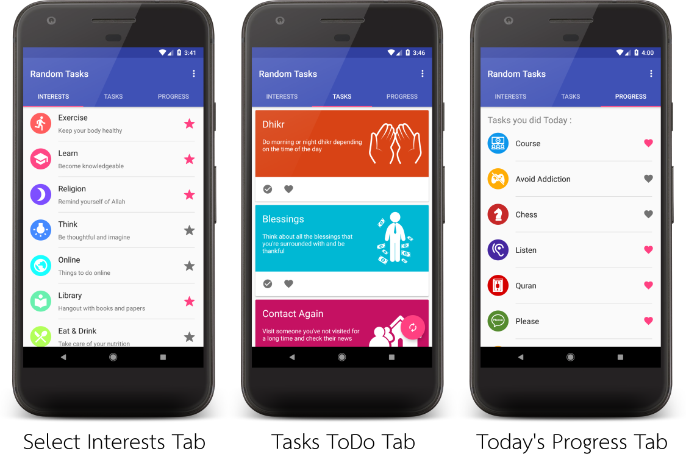

# Random Tasks

An Android application that displays random tasks to the user to do every now and then.
Tasks can be customized from the list of categories in the Interests tab,
and once a task is mark as complete, it will be displayed in today's Progress tab.
This was a small project for Design & Authoring course in my university.

## Screenshots

## License

Copyright (C) 2018 by Omar Einea.

This website is licensed under MIT License.
A copy of the license can be found [here](./LICENSE.md).
